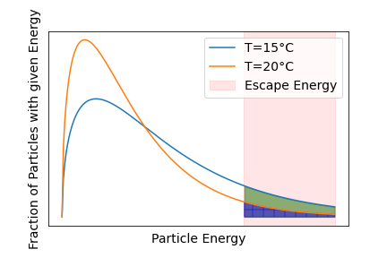
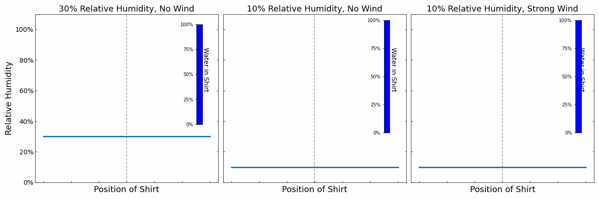
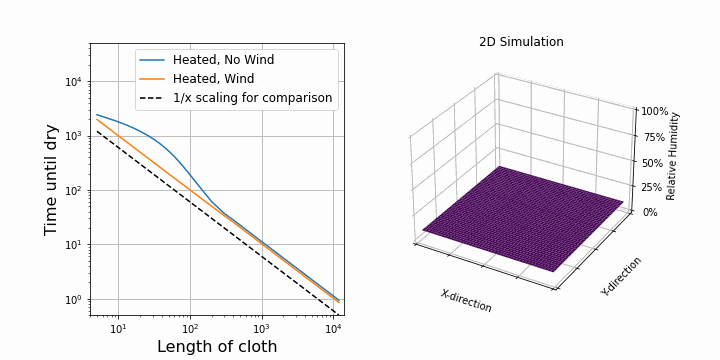

## Introduction
How long does it take for my clothes to dry outside? Actually, why are they drying when water only boils at 100°C? The answer to the second question is rather simple once you understand what temperature actually is.

Let's start with temperature. To understand it better, I will introduce what is called the kinetic theory of gases. When looking at gases or fluids, we view them as an ensemble of their particles. We can imagine these particles as tiny round balls that move around and bounce off each other. The temperature of air is then given by the speed (or kinetic energy) of these particles. At higher temperatures, the particles move faster and at lower temperatures they move slower.
When we say that the temperature in a room is 20°C this means that the particles in the air have a certain amount of kinetic energy, or in other words, they move at a certain speed. This way of describing temperature is called the kinetic theory of gases in which many attributes of the air can be derived by looking at the gas particles in the air. 

## The Physics: Kinetic Theory for Gas and Fluids

Now, the particles don't all move at the same speed. Through collisions with other particles, they exchange energy and their speed changes. The energy of the particles quickly follows the Maxwell-Boltzmann distribution as shown in the figure below. There are some particles at low speeds, then there will be one speed that is most commonly found among the particles. This speed can be used to determine the temperature of the gas. The important part is that there is also a small fraction of particles with high speeds. Even at very high speeds, the possibility of finding a particle with that speed is close to 0, but not exactly zero. The particles with high speeds are what make evaporation possible.

Turning from air now to a wet shirt. The water particles in the shirt can be described similarly to the air particles, i.e., there are particles with lower energy and those with higher energy. The important bit is that some water particles have enough energy to break free from the shirt into the surroundings. This process is evaporation. From the Maxwell-Boltzmann distribution, we can already see that the evaporation chance or evaporation rate is higher at higher temperatures because more water particles have enough energy to break free. Once these high-energy particles leave the shirt, the average energy of the remaining water particles are smaller. After some bouncing around, their distribution will readjust to a Maxwell-Boltzmann distribution of lower energy. In other words, the shirt cools due to evaporation.

Let's look at the temperature of the shirt while drying in a bit more detail. If we only consider this effect, our shirt would lose energy non-stop and the temperature of the shirt would constantly drop. However, the surrounding air is trying to keep the shirt at the ambient temperature (20°C for example). The temperature of the shirt stabilises at the point where the energy lost from evaporation and the energy received from the surrounding air equalises. As a result, the drying shirt is always colder than its surrounding energy. The temperature loss from evaporation can be useful for us, here are 2 ways to use the knowledge: 
* If you are hot and want to cool down, then pouring water on your shirt will make the shirt cooler (Sweating is working the same way). 
* In winter, it can be really hard to tell if your clothes are cold and wet or just cold (and dry). The solution is to hold the clothes against your cheeks or lips (if your cheeks are cold too). If the clothes are dry, they will quickly heat up to body temperature. If they are still wet, they are still evaporating and will not reach body temperature and will be colder.

Great, you did the test and your clothes are still wet, so what did you do wrong? How can you make your clothes dry faster? Roughly speaking 3 effects at play affect the drying speed of your clothes:
1. Evaporation speed: This depends on the temperature of the surroundings. The Sun can speed up the process by providing additional energy.
2. Diffusion speed: The speed at which water vapour gets transported away from the shirt after evaporation. This mainly depends on the relative humidity of the surroundings and *wind* is very important in this process.
3. Water movement inside the shirt: Water evaporates only on the surface of the shirt that is exposed to air. Depending on the  material and thickness of the item, it takes longer for water from the centre to reach the surface.

We don't have much control over the third effect, so we use simplifying assumptions (as physicists love to do). We assume that the shirt is very thin and basically all the water sits at the surface ready to evaporate at any time.

So let's look at a couple of simulations to get a better understanding.

Our shirt is represented by a the point in the middle. It releases water into its surroundings leading to an increase in the humidity. The additional moisture is then transported away slowly via diffusions. There are 3 different scenarios. The scenario on the left and in the middle demonstrate the impact of the relative humidity of the surrounding air. The higher the humidity, the slower moisture can be transported away. The evaporation of the shirt stops when the air right next to the shirt reaches 100% relative humidity. There is no space for further water in the air until the water is diffused away. We can see that the shirt dries slower on the left due to the higher humidity.

On the right, we simulated the effect of wind. Wind causes the water in the air around the shirt to be moved away faster. We can see that the relative humidity around the shirt does not reach 100% and the shirt can always evaporate at maximum speed.

From this little simulation, we learnt that the drying speed of the cloth is limited either by the diffusion speed or the evaporation speed. If it is limited by the diffusion speed (e.g. no wind), then even increasing the evaporation speed does not help. We need to get rid of the moisture in the air. On the other hand, if the evaporation speed is limiting the drying process, then we can speed up the drying process by heating the clothes.

We can see these limits clearly in the plot above where the moisture in the shirt is shown against drying time. For high humidity and the standard case, the drying process starts of in the evaporation limited regime where the drying speed only depends on the evaporation rate. Once the surrounding fills with moisture and reaches 100% relative humidity, the drying process becomes limited by diffusion. At higher ambient relative humidity this happens faster.

If there is a strong enough wind present, we see a straight line because water is leaving the shirt at a constant rate, the evaporation rate. The wind ensures that moisture is carried away fast enough so that the surrounding air never reaches 100% relative humidity If we now additional heat the shirt, the evaporation rate increases as shown by the dotted red line. 

## The Cloth Hanging Trick

There is one point, we neglected so far and that is surface area. Normally, you would fold your shirt in half and hang it on the line. This cuts the surface area of the shirt exposed to air in half. If you are in the possession of clothing pegs, you can the shirt from the bottom and keep the whole surface exposed to air.

I suspect that the drying speed should be proportional to the surface area exposed to air. So, after upgrading our 1D simulation to 2D, I was able to confirm this. On the right, you can see the same simulation as above, but this time in 2D. The shirt is hung along the y-axis. On the left, I plotted the drying time against the length of the shirt while keeping all other parameters constant. First, I did this for the case with wind. We see a perfectly straight line on a log-log scale which verifies that the drying speed is proportional to 1/length. 

Interestingly, for the case with no wind, at first, it looks like it is not following the 1/length line, but it does so later on. This is because of diffusion towards other y-direction. Before, water could only diffuse along the x-direction, but now we added the y-direction, so water can also diffuse in that direction. This becomes important at the border of the shirt. If the shirt is now represented by 1 point, then almost all points feel this border effect. If the shirt is represented by many points (e.g. 1000), then only a few points experience the border effect and overall it follows the 1/length case. When dealing with simulations, these border and boundary effects are always troublesome.

So to summarise:
* The speed of diffusion speed depends on the temperature of the air, but also on the relative humidity.
* The wind helps carry the wet air away from the shirt.
* It is not always the case that the diffusion speed is smaller than the evaporation speed. In this case, increasing the evaporation speed (heating the shirt) will speed up the drying process.

## Next steps
Now this whole experiment has been very theoretical which was enough to get the insights that I wanted to get. I never told you what where the actual diffusion speeds, the temperatures or the amount of water in the shirt that needs to evaporate. I think the diffusion speed of water vapour in the air can be calculated when knowing the temperature and relative humidity of the air, but for the other numbers, we would need to run some experiments to determine them. Here is a link to a website where they did such experiments.

But you can also just look at literature and find these values. There exists a formula that estimates the drying time of your laundry given parameters such as temperature, relative humidity and wind speed. Using weather forecast data, one can calculate the hours required to dry clothes for a given day. This can even be visualised for a whole country. With an extended forecast over a whole week, we could create a map that tells the best day to dry your clothes depending on your location. This could be an exciting project to practice some geoinformatics.
